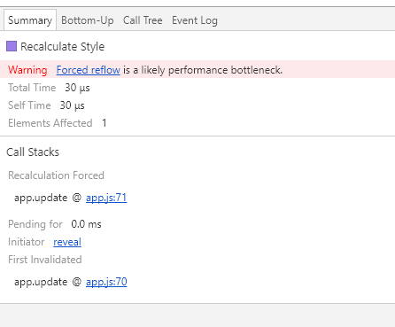

Chrome性能工具分析检测的使用
=======
## 前端页面渲染——原理：
**定义：**  即是web用户在访问一个页面时所要花费的时间总和。即一个完全意义上的用户响应时间，相对于服务器的响应时间而言还会包括更多的内容和影响因素。那么一个web页面的完整请求包括了哪些部分的时间总和就是web前端性能分析和优化所需要了解的基础知识，先了解一下用户从浏览器访问一个url后到页面完全展示所有内容的整个过程吧。    
    
**页面请求的过程：**
1. 浏览器的url请求  
2. 递归寻找DNS服务器 
3. 连接目标IP并建立TCP连接   
4. 向目标服务器发送http请求  
5. web服务器接收请求后处理   
6. web服务器返回相应的结果【无效、重定向、正确页面等】   
7. 浏览器接收返回的http内容 

**页面解析的过程：**    

1.	Dom Tree：浏览器将html解析成一个dom树，dom树的创建时一个深遍历的过程。
2.	Css Rule Tree：将css样式全部解析成Css Rule Tree的规则树。
3.	Render Tree：将Dom Tree和Css Rule Tree结合进行Render Tree的构建，Render Tree不同于Dom Tree，它将一些没有必要渲染的dom节点进行了相应的处理，例如：header标签，display为none的标签元素等。
4.	layout：有了Render Tree我们就可以对每个节点在屏幕中的位置进行计算处理。
5.	paiting: 最后通过位置和样式进行相应的节点进行绘制展示在前端页面上。

**影响前端流畅相应的因素（回流与重绘）**    
减少Render Tree的回流和重绘，主要需要处理的是**回流**问题。     
**定义：**  
**回流：** Render Tree中的元素因为尺寸，布局，隐藏等改变而需要重新构建，这就叫做回流（reflow）。

**重绘**：当Render Tree的一部分元素需要更新元素，而这些元素只是外观，风格不影响布局，则叫做重绘。 

**注：** 回流必定带来重绘，而重绘不一定会回流，回流带来页面渲染的工作量打，过多的回流容易造成页面的卡顿。

**浏览器的优化策略：**  
一般浏览器都会进行回流的优化处理，因为回流的代价比较大，所以如果每一个操作都需要进行回流处理，那么浏览器很容易承受不住，于是浏览器自身就进行了优化处理，将回流和重绘操作放置在一个队列中，在到达一定时间或者一定数量则进行**批量**的处理，这样将多次的回流和重绘操作减少成为一次的操作。

**前端注意：**  
一些操作可能提前强制浏览器对**队列**进行flush，例如在向浏览器请求一些style信息时就可能造成队列flush。
1.	请求offsetTop、offsetLeft、offsetWidth、offsetHeight时
2.	请求scrollTop、scrollLeft、scrollWidth、scrollHeight
3.	请求clientTop、clientLeft、clentWidth、clientHeight
4.	请求getComputedStyle()计算样式时 

因为请求一些属性时，浏览器为了给精确的值，队列中的一些操作可能会影响到这些值，那么即使获取元素的布局和样式信息根最近发生或者改变的布局信息无关，浏览器都会强行刷新渲染队列。

**减少回流的策略：** 减少回流和重绘其实就是减少对Render Tree的操作，减少对一些style信息的请求，尽量利用浏览器的优化策略。
1.	直接改变className，如果动态改变样式则使用cssText（考虑没有优化浏览器）
    ```
       // 不好的写法
       var left = 1;
       var top = 1;
       el.style.left = left + 'px';
       el.style.top = top + 'px';
       // 比较好的写法
       el.className = 'class1';
    ```
2.	让操作元素进行“离线处理”，处理完一起更新    
    a) 使用DocumentFragment进行缓存操作,引发一次回流和重绘；  
    ```
    // 不好的写法
    var p = document.createElement('p');
    var t = document.createTextNode('text1');
    p.appendChild(t);
    document.appendChild(p); // 引起一次回流
    p = document.createElement('p');
    t = document.createTextNode('text2');
    p.appendChild(t);
    document.body.appendChild(p); // 又引起一次回流
    // 比较好的写法
    var farg = document.creatDocumentFragment();
    var p = document.creatElement('p');
    var t = document.creatTextNode('text1');
    p.appendChild(t);
    farg.appendChild(p);
    p = document.creatElement('p');
    t = document.creatTextNode('text2');
    p.appendChild(t);
    farg.appendChild(p);
    document.body.appendChild(frag); // 这样只会引起一次回流
    ```
    b) 使用display:none技术，只引发两次回流和重绘；  
    ```
    var container = document.getElementById('div1');
    container.style.display = 'none'; // 引起一次回流
    for (var i = 0; i < 10; i++) {
        var p = document.createElement('p');
        var t = document.creatTextNode('text' + i);
        container.appendChild(p);
    }
    container.style.display = 'block'; // 引起另外一次回流
    ```
    c) 使用cloneNode(true or false) 和 replaceChild 技术，引发一次回流和重绘； 
    ```
    //建立克隆镜像
    var oldNode = document.getElementById('target'),
    clone = oldNode.cloneNode(true);   //深复制
    //   处理克隆对象的操作....
    //完成后
    oldNode.parentNode.replaceChild(clone,oldNode);
    ```
    
3.	不要经常访问会flush队列的属性，如果确定要访问，则多利用缓存
    ```
    // 不好的方式
    for(循环) {
        el.style.left = el.offsetLeft + 5 + 'px';
        el.style.top = el.offsetTop + 5 + 'px';
    }
 
    // 好的方式
    var left = el.offsetLeft,
    top = el.offsetTop,
    s = el.style; 
    for (循环) { 
        left += 10; 
        top += 10; 
        s.left = left + 'px'; 
        s.top = top + 'px'; 
    }
    ```
4.	让元素脱离动画流，减少回流的Render Tree的规模


## Performanance的使用
**Chrome Performance：** 主要是用于页面性能分析，可进行页面状态、事件、运行、内存查看，通过操作页面查看性能情况，进行分析定位。  
Demo测试： [https://googlechrome.github.io/devtools-samples/jank/](https://googlechrome.github.io/devtools-samples/jank/)

1、先对移动方块进行添加，添加至页面进行卡顿，因为每台机器的性能不同，添加至一定数目之后才会造成卡顿
  
2、打开开发者工具进行performance的记录得到分析数据的展示情况。  
  
	1）数据展示主要的花费事件在于Rendering  
	  
	2) fps显示红色提醒，卡顿，缩放至细节查看    
	  
	  
	3)点击有红色三角的Recalculate Style的调用栈。       
	发现有提示可能发生回流情况，点击reveal查看详细信息。    
	      
	进入代码查看在app.js的70行代码发生了回流情况。      
	   
	发现在其中多次访问了offsetTop的属性，造成了回流问题。       
	      
3、在采用另外一种优化性能方式查看代码（获取样式top缓存处理不多次访问），发现页面流畅了很多。        
  

## Memory的使用
**Chrome Memory：** 主要是用于深度性能分析，提供记录场景运行、记录堆快照、记录堆分配等三个功能实现对渲染性能和内存泄漏的分析定位。

**快照的方式**
Demo测试： [https://googlechrome.github.io/devtools-samples/jank/](https://googlechrome.github.io/devtools-samples/jank/)
目前采用比较多的方式是是使用快照对比来完成，如图：  
    
1、首先在初始化页面进行一次快照处理记录初始化状态。（基本参照）     
  
2、然后进行点击添加按钮进行widget的创建添加。   
  
3、接着进行删除操作对widget进行了移除处理，进行一次快照获取。   
   
4、然后反复先前操作进行快照记录处理。       
   
可以发现内存在一次次操作后得到的快照内存大小不断的在增长，这个时候就可以判断出应该是有内存泄漏没有被回收。  
   
5、将获取的快照进行对比处理。   
   
6、对引用类型（以Detached DOM 为例子）进行分析查看， #Delta是否有不断增加，如果有则是有异常内存泄漏。        
       
7、查看详细增长内容有属性被哪些地方引用而导致没有办法回收，发现widget的一些信息没有被回收而一直存在。     
       
8、通过删除操作找到对应的代码，来查看widget被移除操作中间发生了什么而导致widget内容没有被回收，发现index.html代码中有问题。 
```
// 问题所在
domConstruct.destroy(window.container1.domNode); // 只是移除了dom节点，并没有对widget整个对象进行处理导致有引用存在

// 将widget进行整个摧毁处理调用destroy方法
window.container.destroy(); //  进行widget的摧毁处理
```
9、之后再次进行来看内存是否能够被及时的处理，发现内存增长停止了，并且Detached DOM增长没有了，内存被及时的回收防止了内存的泄漏。     

   

Memory还有提供另外两个分析内存的工具。      
**Collect JavaScript CPU Profile：** 记录一段场景cpu的分配使用情况。   

       
对其中对内存影响较大的，并且有提示的方法进行相应的注意和相应的处理  

       
**Record Heap Allocations：** 一段记录堆分配内存进行处理    

      
堆突出的蓝条，如果没有释放掉要进行特别注意并且分析其中的情况详情，如果没有释放则需要跟踪代码进行处理        

   

#### 内存泄漏的原因：   
（1）监听在window/document/body等handler事件没有解绑


（2）模块形成的闭包内部变量使用完后没有将引入变量设为null


（3）使用第三方库创建，没有调用正确的销毁函数


（4）dom的移除若子节点存在引用则无法回收


（5）widget使用事件的订阅，在摧毁时没有移除

## 给你的话
在**Performance**中已经可以完成大多数的性能检测定位。而在其中**Memory**进行详细分析处理内存泄漏问题处理，使用工具处理问题是一部分解决方案，但是根源问题还是在于**编码的规范**问题，如果已经成熟的系统，在内存性能检测上是很麻烦的事情，所以内存性能检测是一个**不断持续**的过程。    

内容中如果出现什么有错误的地方请及时的提醒，以便进行及时的修正。

